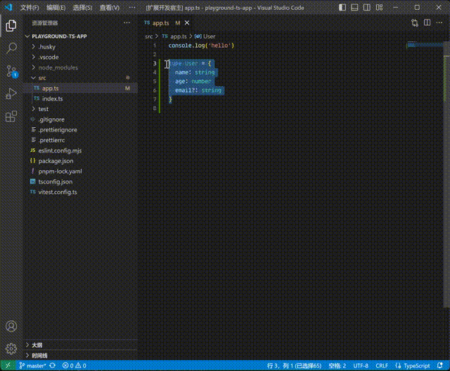

# type to zod

一个VSCode插件，用于将TypeScript的类型转换为[zod](https://zod.dev/)模式，并将生成的zod描述自动复制到剪贴板。

该插件通过代码操作（Code Actions）和命令的方式提供功能，让开发者更方便地在TypeScript代码中生成zod模式。

## 链接

- [github仓库](https://github.com/lsby/vscode-type-to-zod)
- [vscode商店](https://marketplace.visualstudio.com/items?itemName=hbybyyang.lsby-vscode-type-to-zod)

## 功能

- 在TypeScript和TypeScript React文件中，可以通过选中部分代码生成对应的zod模式。
- 生成的zod描述会自动复制到剪切板。
- 快速修复功能：当选中代码后，右键可以快速生成zod描述。

## 演示



## 使用方法

### 通过命令生成zod描述

1. 打开一个TypeScript或TypeScript React文件。
2. 选中你想要转换为zod模式的TypeScript类型代码。
3. 在代码修复中选择 **生成zod描述**，插件将会自动生成对应的zod代码并复制到剪切板。

## 示例

假设你有以下的TypeScript代码：

```typescript
type User = {
  name: string
  age: number
  email?: string
}
```

选中该部分代码，右键选择 **生成zod描述**，会生成并复制以下内容到剪切板：

```typescript
const User = z.object({
  name: z.string(),
  age: z.number(),
  email: z.string().optional(),
})
```

## License

MIT License.
